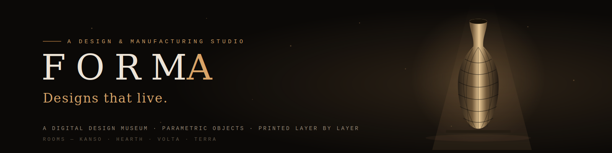

<p align="center">
  
</p>

<p align="center">
  <a href="https://theprotagonist07.github.io/forma-studio/"><b>⟡ &nbsp;ENTER THE EXHIBITION — LIVE DEMO&nbsp; ⟡</b></a>
</p>

<p align="center">
  <i>A digital design museum for an original 3D design &amp; manufacturing studio — <b>not a store</b>.<br>
  Every object is designed from zero in parametric CAD and grown layer by layer in-studio (Lucknow, IN).</i>
</p>

---

## The exhibition

Four collection "rooms" that each transform the entire site — palette, typography, motion language, storytelling voice — plus a product gallery, a parametric configurator, and an instant-quote engine. Walk them live:

| Room | Live page | World |
|---|---|---|
| **Entrance** | [index.html](https://theprotagonist07.github.io/forma-studio/) | Dark museum hall — dust motes, spotlights, a vessel on a pedestal |
| **01 · Kanso** | [collection-minimalist.html](https://theprotagonist07.github.io/forma-studio/collection-minimalist.html) | Japanese paper-white silence, two-second fades, vast whitespace |
| **02 · Hearth** | [collection-cozy.html](https://theprotagonist07.github.io/forma-studio/collection-cozy.html) | Candlelight flicker, floating embers, winter evenings |
| **03 · Volta** | [collection-cyberpunk.html](https://theprotagonist07.github.io/forma-studio/collection-cyberpunk.html) | Neon glitch typography, scanlines, mouse-reactive particle grid |
| **04 · Terra** | [collection-organic.html](https://theprotagonist07.github.io/forma-studio/collection-organic.html) | Morphing growth forms, generative-design story, earth tones |
| **Object** | [product.html](https://theprotagonist07.github.io/forma-studio/product.html) | Drag-to-rotate 3D turntable, manufacturing timeline, full specs |
| **Atelier** | [configurator.html](https://theprotagonist07.github.io/forma-studio/configurator.html) | Sliders rewrite live 3D geometry → price, weight &amp; print-time respond |
| **Custom** | [quote.html](https://theprotagonist07.github.io/forma-studio/quote.html) | Drop an STL → real in-browser mesh analysis → instant quote |

Every page carries a floating **MOCKUPS** switcher (bottom-right) for jumping between rooms.

## Engineering highlights

- **3D without a 3D library.** The product viewer and configurator render a parametric lathe surface — depth-sorted quads, painter's algorithm, fake key light — on a plain 2D canvas in ~80 lines. No three.js, no WebGL, no dependencies.
- **Real mesh analysis, client-side.** The quote engine parses binary *and* ASCII STL, integrates signed tetrahedron volumes (validated: a 20 mm cube reads exactly 8.00 cm³), and reports bounding box + triangle count. Your file never leaves the browser at quote time.
- **Honest pricing model.** Quotes derive from filament mass + machine-hours + handling with a failure buffer and margin — a real manufacturing cost function, not a magic number.
- **Atmosphere as architecture.** Each room ships its own motion system: slow-fade observers (Kanso), ember particle canvas (Hearth), reactive particle grid + CSS glitch clipping (Volta), morphing border-radius growth forms (Terra).
- **Zero build step.** Eight self-contained HTML files. Google Fonts is the only external dependency.

## Run locally

```bash
git clone git@github.com:TheProtagonist07/forma-studio.git
cd forma-studio
python3 -m http.server 8423 --directory mockups
# → http://localhost:8423
```

## Roadmap

These mockups are the design-system spec for the production build:

- **Next.js + PostgreSQL + Razorpay** storefront with SSR and schema.org product markup
- **Parametric order pipeline** — customer parameters → scripted CAD model → STL → print queue, automated end-to-end with n8n on self-hosted infrastructure
- **Real photography** (Sony A5100 studio pipeline) replacing the illustrative vector art
- Per-unit **timelapse "birth certificates"** shipped with every printed object

## Design system

Global identity: near-black `#0b0907` · warm amber `#d9a468` · Fraunces (display serif) · Space Grotesk (UI) · JetBrains Mono (engineering labels). Full notes in [mockups/README.md](mockups/README.md).

---

<p align="center">
  <sub>© FORMA studio · Designed &amp; built by <a href="https://github.com/TheProtagonist07">TheProtagonist07</a> · All product geometry, designs and content are original work — please don't reuse without permission.</sub>
</p>
